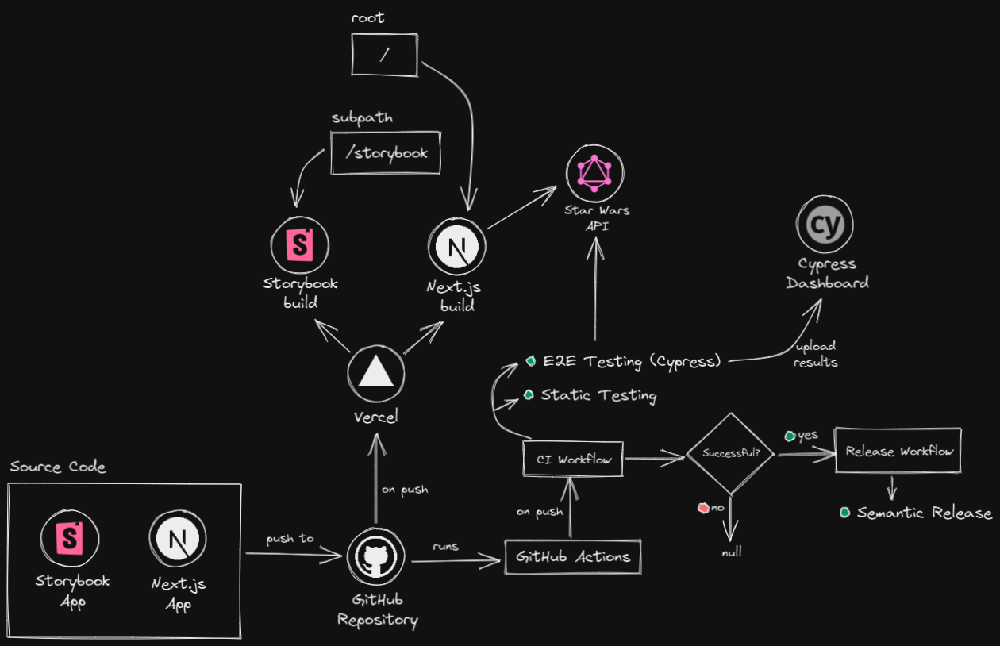

# sw.rcrd.space 🛰

<div align="center" style="height:360px;margin-bottom:40px;">
  <a href="https://www.loom.com/share/0852e775ad6946f3939137eb47bd2458">
    
  </a>
  <p><em>Application walkthrough</em></p>
</div>

---

<div align="center" style="height:360px;margin-bottom:32px;">
  <a href="https://excalidraw.com/#json=k6pQGzgskJz0DcXvO7xDt,bYqI9PPcI8CB3vue35JRGQ">
    
  </a>
  <p><em>Architecture overview</em></p>
</div>

---

## Deploys

- **Web**: https://sw.rcrd.space
- **UI**: https://sw.rcrd.space/storybook
- **E2E**: https://dashboard.cypress.io/projects/rfp1ky

## Architecture

- **Framework**: [Next.js](https://nextjs.org)
- **Component Driven**: [Storybook](https://storybook.js.org)
- **Styling**: [Tailwind CSS](https://tailwindcss.com)
- **Backend**: [Star Wars GraphQL](https://swapi-graphql.netlify.app)
- **Deployment**: [Vercel](https://vercel.com)

## Structure

```
├── 📁 cypress
|  ├── 📂 e2e: All End-To-End tests
├── 📁 public: Folder to serve static files
├── 📂 src: Contains all the code source
|  ├── 📄 env.ts: Single entry point for all env vars
|  ├── 📂 gql
|  |  ├── 📄 index.ts: Generated types by GraphQL Codegen
|  |  └── 📁 queries: GraphQL queries documents
|  ├── 📁 layouts: Layout components
|  ├── 📁 lib: Connectors to external services
|  ├── 📁 pages: Next.js pages
|  ├── 📂 styles: Raw *.css files
|  ├── 📂 ui
|  |  ├── 📁 components: Shared components
|  |  ├── 📁 core: Design System components
|  |  ├── 📁 icons: SVG Icons
|  |  └── 📄 theme.ts: Design tokens
|  └── 📁 views: Out of Next.js routing components
```

> Other folders and files are required for tools configuration

## Running

### Requirements

- Node.js `>=14.x`
- Yarn `^1.x`

> You can use [nvm-sh](https://github.com/nvm-sh/nvm) or [nvm-windows](https://github.com/coreybutler/nvm-windows)

### Prepare

```bash
git clone https://github.com/rqbazan/ravn-challenge-v2-ricardo-q-bazan.git
cd ravn-challenge-v2-ricardo-q-bazan
cp .env.example .env
yarn
```

### Development

- To run the Next App

```bash
yarn dev

```

- To run the Storybook App

```bash
yarn storybook

```

### Production <sup>_similar_</sup>

1. Install `vercel` CLI globally

```bash
yarn global add vercel
```

2. Run `vercel` in dev mode

```bash
vercel dev
```

## Considerations

- The commit history follows [Semantic Versioning](https://semver.org/), enforced by [commitlint](https://github.com/conventional-changelog/commitlint)
- The [automatic releases](./.github/workflows/release.yml) are made by [Semantic Release](https://github.com/semantic-release/semantic-release)

## License

MIT © [Ricardo Q. Bazan](https://rcrd.space)
